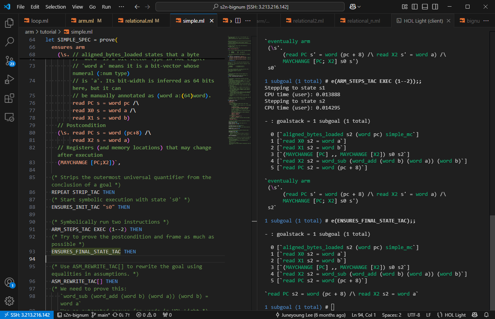

# HOL Light Setup

## 1. Building HOL Light

Assuming that [OPAM](https://opam.ocaml.org/doc/Install.html) is installed in your machine, you can install HOL Light from OPAM.
This will copy `hol.sh` to an executable path so that you can run `hol.sh` from anywhere.

```
opam install hol_light
```

Running `hol.sh` will launch an OCaml REPL with the kernel of HOL Light loaded, after
lengthy message prints for a few minutes.

Or, you can easily build HOL Light by yourself using the following instructions which are also described in [README](https://github.com/jrh13/hol-light/blob/master/README):

```
git clone https://github.com/jrh13/hol-light.git
cd hol-light
make switch # use 'make switch-5' if you want to use OCaml 5
eval $(opam env)
make
# Now you have 'hol.sh' .
```

**s2n-bignum**. If you want to build s2n-bignum proofs, you will want the HOL Light cloned from Github, with module compilation turned on.
Please see the 'Compiling HOL Light proofs' section below.

**If loading `hol.sh` says `ledit` cannot be found**
On Mac, `ledit` might not be found from PATHs even after installed. In this case, please rely on `brew install ledit`.
If your distribution cannot find `ledit`, you can proceed `export LINE_EDITOR=" "` on the terminal and rerun `hol.sh`.
This will introduce some inconveniences (for example, arrow keys will not work), but if actual source code editing
will be done on a separate place like VSCode then it won't matter.

## 2. Setting up VSCode

It is possible to just rely on `hol.sh` and a text editor to develop,
by writing a statement, copying it to `hol.sh`, and seeing the output.
However, there is more ergonomic way to develop in HOL Light.

As an editor, I recommend the [vscode-hol-light](https://github.com/monadius/vscode-hol-light) plugin ([marketplace](https://marketplace.visualstudio.com/items?itemName=monadius.hol-light-simple)).
After installing it, you will want to:

1. Configure `hol-light.path` to your HOL Light directory. If you built HOL Light by yourself, this will be simply the cloned directory. If you downloaded & installed HOL Light from OPAM, it will be `<your home dir>/.opam/<ocaml version>/lib/hol_light`.
3. Associate `.ml` file extension with the HOL Light language, if you are planning to use the `.ml` file extension for your HOL Light programs too.
Note that this will disable using the original OCaml VSCode plugin for the files. The default file extension is `.hl`. You can find
the `Associate .ml Files with HOL Light` command.

After this configuration, run `hol.sh` using `HOL Light: New HOL Light REPL Session` command in VSCode.
After the script is loaded, you can send one statement (or selected statement) to `hol.sh` and develop code interactively.

The README.md file as well as description in its Marketplace webpage
has more information.

**If loading `hol.sh` shows an error about the OCaml version and `findlib.cma`..**
If you configured HOL Light using `make switch` (or `make switch-5`), this can be due to a conflicting setting between
the local OPAM setting inside the HOL Light directory and the global OPAM switch setting.
If the initial OPAM installation inserted the following initialization script to `.zshrc` or `.bashrc` such as:
```
[[ ! -r '/Users/xx/.opam/opam-init/init.zsh' ]] || source '/Users/xx/.opam/opam-init/init.zsh' > /dev/null 2> /dev/null
```
Please remove this line and try running `hol.sh` again.

### Using HOL Light Server to improve experience

Simply using the `hol.sh` in VSCode after following the above instructions has a few missing features.
First, it cannot identify whether the statement sent to `hol.sh` failed or not.
Second, it lacks error message coloring and sometimes has a broken format on its input.

You can enable these features by using a command 'Start Server' in vscode-hol-light.
This command will quickly launch HOL Light Server on the currently loaded `hol.sh`, and start
interaction mode via this server.
This does not need separately downloading the server from your side because vscode-hol-light already has it.



### Remotely connecting to `hol.sh`

The true power of HOL Light Server is that it enable you to remotely access to an already running `hol.sh`.
It removes inconvenience of restarting `hol.sh` after network connection is down.
This is very convenient if you are working remotly from a server and using SSH connection in VSCode.

In order to use this feature, clone this repo in your HOL Light directory:

```
git clone https://github.com/monadius/hol_server --branch vscode
# You don't need to run 'make'.
```

After this, run these statements on `hol.sh`. This will bind port 30000
to the server.

```
#directory "+threads";;
#load "unix.cma";;
#load "threads.cma";;
#mod_use "{path to the server}/server2.ml";;
Server2.start 30000;;
```

Now `vscode-hol-light` can connect to this server with port 30000.

**When HOL Light server becomes unusable after network disconnection.**
If the network between your local laptop (where VSCode runs) and the remote machine
is disconnected, it is normal for the HOL Light Server to print `[STOP] Connection closed`,
but sometimes the server thinks its connection is still valid and refuse to establish any
further connection, making the server unusable.
In this case, type "stop" on the terminal where HOL Light Server was running.
It will force HOL Light Server to disconnect & be ready for the next connection.

## 3. Checkpointing

To avoid the loading time of `hol.sh`, you can use a checkpointing tool that will store
the loaded process as a binary.
DMTCP is recommended, and README of HOL Light has an instruction.

Once `dmtcp_restart_script.sh` is created, you can run the script to reload `hol.sh` without waiting.
You can create multiple instances of loaded HOL Light processes by starting the script with distinct
ports `-p <port number>`.

The latest HOL Light provides `make-checkpoint.sh`. You can use, e.g., `make-checkpoint.sh my-ckpt.sh`.
This also requires DMTCP.
`make-checkpoint.sh` takes an optional second argument which is the statement to execute.
For example, `make-checkpoint.sh my-ckpt.sh 'loads "Multivariate/make.ml"'` will load the Multivariate
library and checkpoint.

## 4. Compiling HOL Light proofs

Set the `HOLLIGHT_USE_MODULE` environment variable to 1 and recompile HOL Light using `make`.
This will create `hol_lib.cma` and `hol_lib.cmxa`.

```
export HOLLIGHT_USE_MODULE=1
make
# Now you have 'hol.sh', 'hol_lib.cma' and 'hol_lib.cmxa'.
```

This will exactly be what is necessary to build s2n-bignum proofs (`make proofs` from s2n-bignum).
Please refer to the 'COMPILING HOL LIGHT' section of [README](https://github.com/jrh13/hol-light/blob/master/README).

If you want to install hol light from OPAM:

```
# To compile the core module of HOL Light and use, add hol_light_module
opam install hol_light hol_light_module
```

If you are using Mac OS and installed OCaml using Homebrew, you might face a linker failure problem like this:
```
ld: library 'gmp' not found
clang: error: linker command failed with exit code 1 (use -v to see invocation)
```
Updating `LIBRARY_PATH` to point to the path can resolve this problem.
```
export LIBRARY_PATH=/opt/homebrew/lib/:$LIBRARY_PATH
```
